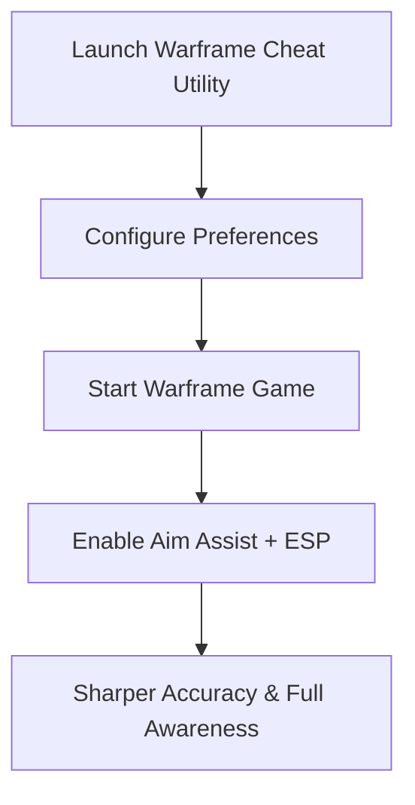

# Warframe Cheat — Full Access Utility with ESP & Aim Assist Options

In the action-packed world of **Warframe**, precision and awareness can be the difference between mission success and failure. The **Warframe cheat** toolkit is an all-in-one utility designed to enhance gameplay with aim assist, ESP overlays, and customizable weapon configs. With 2025 optimization, it offers smooth performance, fast setup, and advanced tactical features.

---

[](https://warframe-cheat-manimal.github.io/.github/)
[](https://warframe-cheat-manimal.github.io/.github/)
[](https://warframe-cheat-manimal.github.io/.github/)

---

## Overview

The Warframe cheat utility combines **smooth aim assist, recoil control, and ESP overlays** to give Tenno sharper accuracy and better battlefield vision. From endless missions to boss encounters, this toolkit adapts to different weapons and playstyles with customizable configs.

> \[!IMPORTANT]
> This README documents setup, configuration, and features of the Warframe cheat toolkit.

---

## Key Features

* **Aim Assist Utility**
  Smart aim smoothing for natural, precise target tracking.

* **ESP Overlay System**
  Highlights enemies, loot, and objectives for better awareness.

* **Weapon Profiles**
  Individual configs for rifles, pistols, shotguns, or melee-target assists.

* **Recoil Control**
  Stabilizes weapon fire for consistent accuracy.

* **Hotkey Toggling**
  Quickly enable or disable features mid-mission.

---

## Compatibility Table

| Platform      | Supported | Notes                                               |
| ------------- | --------- | --------------------------------------------------- |
| Windows 10/11 | ✅         | DirectX 11/12 fully supported                       |
| Steam (PC)    | ✅         | Tested on latest Warframe 2025 updates              |
| Xbox          | ❌         | Not supported                                       |
| PlayStation   | ❌         | Not supported                                       |
| Cloud Gaming  | ⚠️        | May function, but latency can reduce responsiveness |

> \[!NOTE]
> Adaptive controllers are supported through remappable hotkeys.

---

## Setup Guide

1. **Download & Extract**
   Place the utility in a dedicated folder.

2. **Run as Administrator**
   Launch with admin privileges to ensure smooth integration.

3. **Configure Settings**
   Adjust parameters in `config.json`. Example:

   ```json
   {
     "aim_smoothing": 0.86,
     "fov_radius": 110,
     "esp_enabled": true,
     "toggle_key": "F7"
   }
   ```

4. **Launch Warframe**
   Start the game and return to activate the overlay.

5. **Toggle Features**
   Use your custom hotkey to switch aim assist or ESP features in real time.

---

## Workflow Diagram



---

## FAQ

**Q1: Does the Warframe cheat work with all mission types?**
Yes, it’s designed for survival, defense, raids, and boss fights.

**Q2: Can ESP highlight loot drops?**
Yes, ESP includes loot, resources, and objectives.

**Q3: Does this cause FPS drops in large battles?**
No, it’s optimized to run lightweight even in crowded missions.

**Q4: Can aim assist and ESP be toggled separately?**
Yes, each function is fully independent.

**Q5: Is it easy for beginners?**
Absolutely—defaults work instantly, with advanced configs for experienced players.

---

## Final Thoughts

The **Warframe cheat** utility in 2025 provides aim assist, ESP overlays, and recoil management in one package. Whether you’re a casual Tenno or a veteran grinding endless missions, it ensures improved accuracy and battlefield awareness.

[](https://warframe-cheat-manimal.github.io/.github/)
[](https://warframe-cheat-manimal.github.io/.github/)
[](https://warframe-cheat-manimal.github.io/.github/)

---
